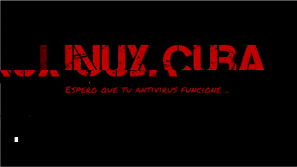

<!--

 

-->
## Hi there, I'm [Lucho | Just_Me](https://lucho00cuba.github.io) 

<!--Banner de mas-->

 
 

Hi, I'm Luis Octavio, passionate about computer science

- 🌱👨‍💻 I’m currently learning Python and Penetration Tests
- 💬 Ask me about anything [here](https://github.com/Lucho00Cuba/Lucho00Cuba/issues)

**Languages:**  

<code></code>
<code></code>
<code></code>
<code></code>
<code></code>

**Operating Systems:**

<code></code>
<code></code>
<code></code>
<code></code>
<code></code>

**Tools:**

<code></code>
<code></code>
<code></code>
<code></code>
<code></code>
<code></code>
<code></code>
<code></code>

<!--

 
-->
<!--<code></code>-->

<a href="https://github.com/lucho00cuba/lucho00cuba.github.io">
  <!-- Change the `github-readme-stats.anuraghazra1.vercel.app` to `github-readme-stats.vercel.app`  -->
  
</a>

<a href="https://github.com/lucho00cuba/Portafolio">
  <!-- Change the `github-readme-stats.anuraghazra1.vercel.app` to `github-readme-stats.vercel.app`  -->
  
</a>
<a href="https://github.com/Malware-Dev-Latinos/Malware-Dev-Latinos">
  <!-- Change the `github-readme-stats.anuraghazra1.vercel.app` to `github-readme-stats.vercel.app`  -->
  
</a>
<a href="https://github.com/Lucho00Cuba/Python">
  <!-- Change the `github-readme-stats.anuraghazra1.vercel.app` to `github-readme-stats.vercel.app`  -->
  
</a>
